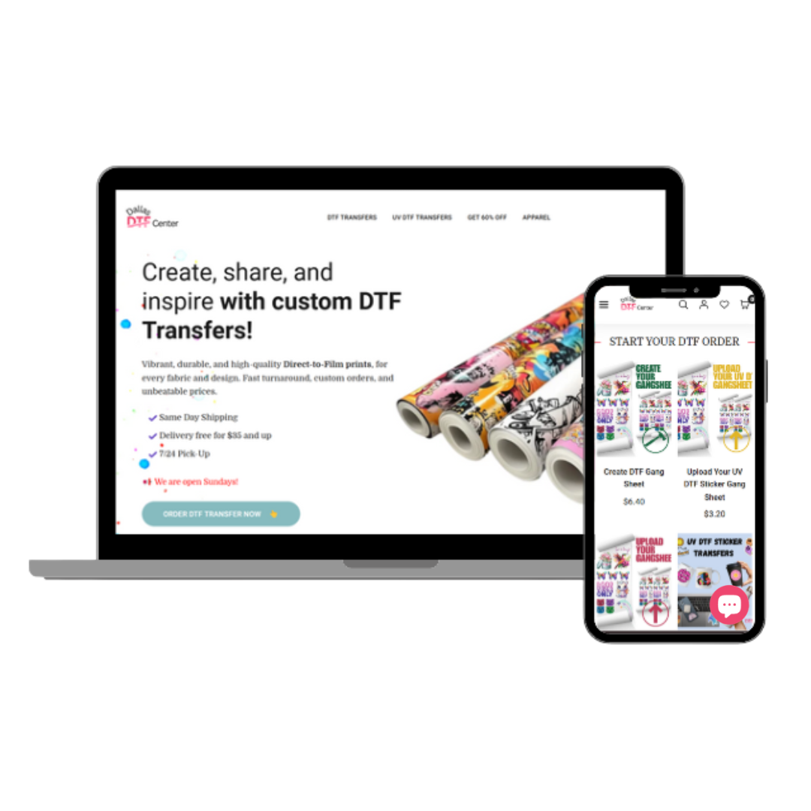

# 💼 Dallas DTF Center – Professional Business Website

**Dallas DTF Center** is a modern, responsive website built for a specialized textile printing business based in Dallas, Texas.  
It features a clean layout, professional branding, and streamlined user experience designed to support both product presentation and customer conversion.

🔗 **Live Site:** [https://dallasdtfcenter.com](https://dallasdtfcenter.com)

---

## 🚀 Key Features

- 📱 **Mobile-Friendly Design** – Fully responsive for all screen sizes  
- 🎨 **Custom Branding** – Business-tailored color palette and typography  
- 🛒 **Product Showcase** – Structured layout to highlight print services and products  
- 📞 **Contact & Quote Forms** – Easy for customers to get in touch  
- ⚡ **Fast & Lightweight** – Optimized for speed and performance  
- 🌐 **SEO-Ready** – Structured for search engine visibility

---

## 📈 Goal

The goal of this project was to establish a strong online presence for a local business offering DTF (Direct-To-Film) printing services. The website serves as both an informational hub and a conversion tool for new clients.

---

## 🧠 What I Learned

- Structuring content for small business needs  
- Applying clean visual hierarchy for service-oriented sites  
- Planning responsive behavior across devices  
- Working with real business requirements in a web design context

---

> 🧩 This project is part of my growing portfolio of real-world website builds for local businesses.  
Feel free to explore or contact me for collaboration opportunities!

